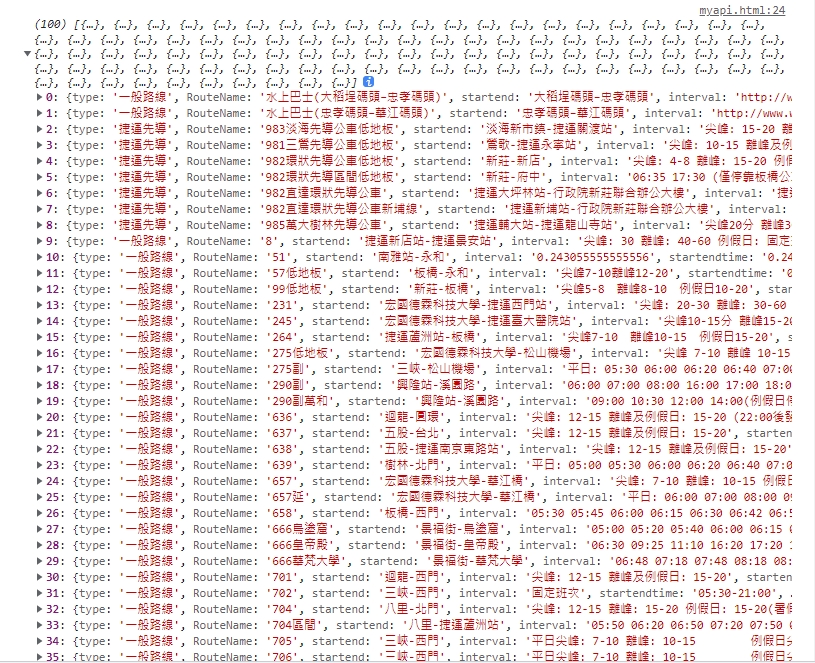

## 串接 API 資料筆記

* 上課用了新北市政府的網站進行api串接，網址如下：
>>https://data.ntpc.gov.tw/
* 可以先註冊後登入進去，也可以不用註冊登入即可進入網站查詢自己要製作的資料

* 資料查詢內可看到資訊一欄表，針對自己要製作的資料點選
* https://data.ntpc.gov.tw/datasets

* 從這裡進入，可以找到OpenData API
* https://data.ntpc.gov.tw/openapi/swagger-ui/index.html?configUrl=%2Fopenapi%2Fswagger%2Fconfig&urls.primaryName=%E6%96%B0%E5%8C%97%E5%B8%82%E6%94%BF%E5%BA%9C%E4%BA%A4%E9%80%9A%E5%B1%80(30)#/JSON/get_1016BB4C_E8EB_4113_A2BE_657FB51A1558_json

 

# 透過 Ajax 取得 api 失敗時
* 這裡示範 getJSON 用法取得，建立檔案 ntpc_curl.htm
>>$.getJSON('https://data.ntpc.gov.tw/api/datasets/1016BB4C-E8EB-4113-A2BE-657FB51A1558/json?page=0&size=100')
  .done(function (re) {
    console.log(re);
  })
  .fail(function (w) {
    alert("faill openapi")
    console.log(w);
  });

 

# 歡迎大家都可以來點選網頁 Access-Control-Allow-Origin
* Syntax
>>Access-Control-Allow-Origin: *
>>Access-Control-Allow-Origin: <origin>
>>Access-Control-Allow-Origin: null

# 不想要讓別人知道自己的網址:
* 可以放在mytoken底下的資料夾，檔名為token.js
* 以下是我自己的練習網址
* let dataUrl = 'https://data.ntpc.gov.tw/api/datasets/1016BB4C-E8EB-4113-A2BE-657FB51A1558/json?page=0&size=100';

# 有抓到資料的myapi.html會有以下圖片

